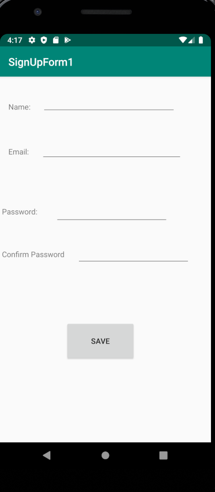

# CIS3515_Lab2_SignUpForm

This application takes a user's name, email, password and password confirmation. 
As long as evey category is filled out, when the user presses the button a toast will welcome the user to the app.

This app was used as a practice to gain experience working with Android Studio.

